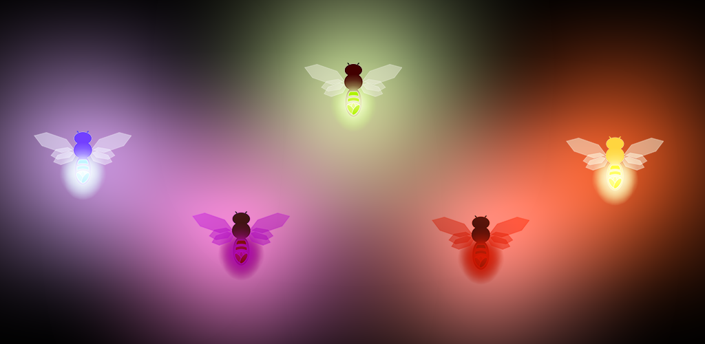
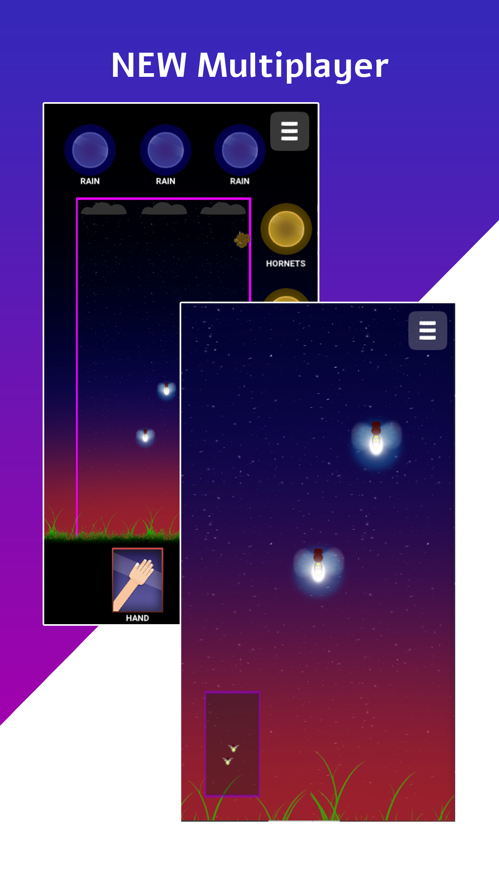

# Firefly

 Dieses Projekt wurde mit Unity und C# erstellt und auf den Plattformen Ios, Android und Windows veröffentlicht.

 In "Firefly" steuerst du ein Glühwürmchen, das am längsten überleben muss.
Dabei triffst du auf Hornissenschwärme, Regen, Hände und Fliegenklatschen, die den Glühwurm töten wollen.
Mehr Informationen findest du auf <a href="http://www.firefly.gratis" >www.firefly.gratis</a>.
<h2>Download & Install</h2>
Sie können die Installationsdatei für Windows, so wie die Apk für Android aus dem <b><a href="Installs/">Installs</a></b> Ordner runterladen.
Des weiteren können sie die Anwendung auch einfach <b><a href="http://www.firefly.gratis/download.html#download">hier</a></b> herunterladen.

<h2>Bilder</h2>
Auch stehen ihnen Voschaubilder, so wie ein Demovideo zur Verfügung. Diese finden sie im Ordner <b><a href="Gallery/">Gallery</a></b>.

